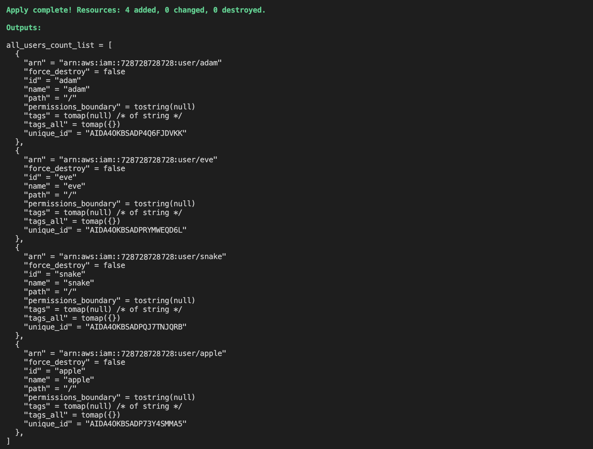
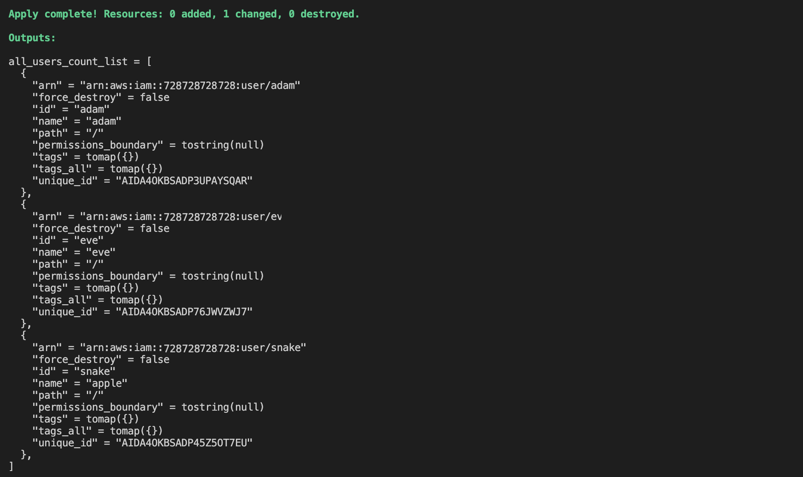
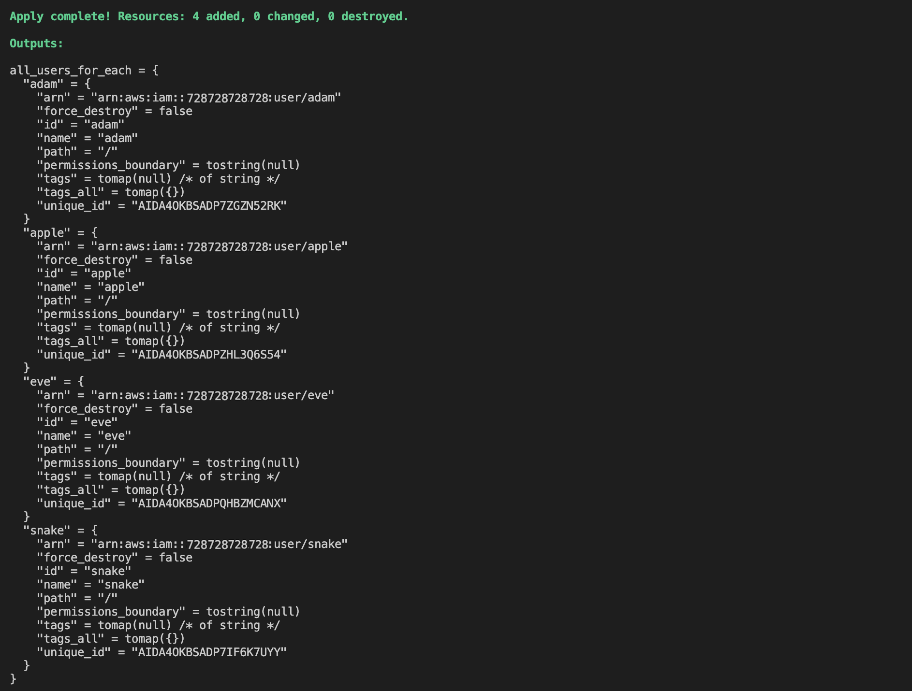

## Additional tips & tricks

Of course there is much more to Terraform than these small examples can provide. Yet there are also some contrains when working with Terraform or declarative languages in general. Typically they do not have  for-loops or other traditional procedural logic built into the language to repeat a piece of logic or conditional if-statements to configure reasources on demand. However, there are ways there are some ways to deal with this issue and to create multiple respurces without copy and paste.

Terraform comes with different looping constructs, each used slightly different. The *count* and *for_each* meta arguments enable us to create multiple instances of a resource. 

### count

Count can be used to loop over any resource and module. Every Terraform resource has a meta-parameter *count* one can use. Count is the simplest, and most limited iteration construct and all it does is to define how many copies to create of a resource. When creating multiple instance with one specification, the problem is that each instance must have a unique name, otherwise Terraform would cause an error. Therefore we need to index the meta-parameter just like doing it in a for-loop to give each resource a unique name. The example below shows how to do this on an AWS IAM user.

\footnotesize
```bash
resource "aws_iam_user" "example" {
  count = 2
  name  = "neo.${count.index}"
}
```
\normalsize

{ width=100% }

\footnotesize
```bash
variable "user_names" {
  description = "Create IAM users with these names"
  type        = list(string)
  default     = ["adam", "eve", "snake", "apple"]
}

resource "aws_iam_user" "example" {
  count = length(var.user_names) # returns the number of items in the given array
  name  = var.user_names[count.index]
}
```
\normalsize

{ width=100% }

After using count on a resource it becomes an array of resources rather than one single resource. The same hold when using count on modules. When adding count to a module it turns it into an array of modules.

This can round into problems because the way Terraform identifies each resource within the array is by its index. Now, when removing an item from the middle of the array, all items after it shift one index back. This will result in Terraform deleting every resource after that item and then re-creating these resources again from scratch

So after running `terraform plan` with just three names, Terraform’s internal representation will look like this:

\footnotesize
```bash
variable "user_names" {
  description = "Create IAM users with these names"
  type        = list(string)
  default     = ["adam", "eve", "apple"]
}

resource "aws_iam_user" "example" {
  count = length(var.user_names) # returns the number of items in the given array
  name  = var.user_names[count.index]
}
```
\normalsize

{ width=100% }

**Count as conditional**
Count can also be used as a form of a conditional if statement. This is possible as Terraform  supports *conditional expressions*. If `count` is set to one 1, one copy of that resource is created; if set to 0, the resource is not created at all. Writing this as a conditional expression could look something like the follow, where var.enable_autoscaling is a boolean variable either set to `True` or `False`.

\footnotesize
```bash
resource "example-1" "example" {
  count = var.enable_autoscaling ? 1 : 0
  name  = var.user_names[count.index]
}
```
\normalsize

### for-each

The *for_each* expression allows to loop over lists, sets, and maps to create multiple copies of a resource just like the *count* meta. The main difference between them is that *count* expects a non-negative number, whereas *for_each* only accepts a list or map of values. Using the same example as above it would look like this:

\footnotesize
```bash
variable "user_names" {
  description = "Create IAM users with these names"
  type        = list(string)
  default     = ["adam", "eve", "snake", "apple"]
}

resource "aws_iam_user" "example" {
  for_each = toset(var.user_names)
  name     = each.value
}

output "all_users" {  
  value = aws_iam_user.example  
}
```
\normalsize

{ width=100% }

Using a map of resource with the *for_each* meta rather than an array of resources as with *count* has the benefit to remove items from the middle of the collection safely and without re-creating the resources following the deleted item. Of course, the same can also be done for modules.

\footnotesize
```bash
module "users" {  
  source = "./iam-user"  
  
  for_each  = toset(var.user_names)  
  user_name = each.value  
}
```
\normalsize

### for

Terraform also offers a similar functionality as Python list comprehension in the form of a for expression. This should not be confused with the *for-each* expression seen above. The basic syntax is shown below to convert the list of names of previous examples in var.names to uppercase:

\footnotesize
```bash
output "upper_names" {
  value = [for name in var.names : upper(name)]
}

output "short_upper_names" {
  value = [for name in var.names : upper(name) if length(name) < 5]
}
```
\normalsize

{ width=100% }

Using for to loop over lists and maps within a string can be used similarly. This allows us to use control statements directly withing strings using a syntax similar to string interpolation.

\footnotesize
```bash
output "for_directive" {  
  value = "%{ for name in var.names }${name}, %{ endfor }"  
}
```
\normalsize

{ width=100% }


### Workspaces

Terraform workspaces allow us to keep multiple state files for the same project. When we run Terraform for the first time in a project, the generated state file will go into the *default* workspace. Later, we can create a new workspace with the `terraform workspace new` command, optionally supplying an existing state file as a parameter.


